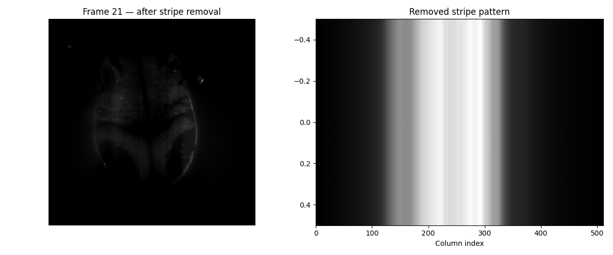
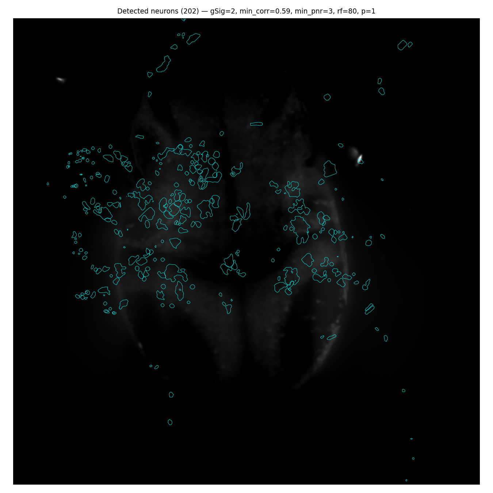
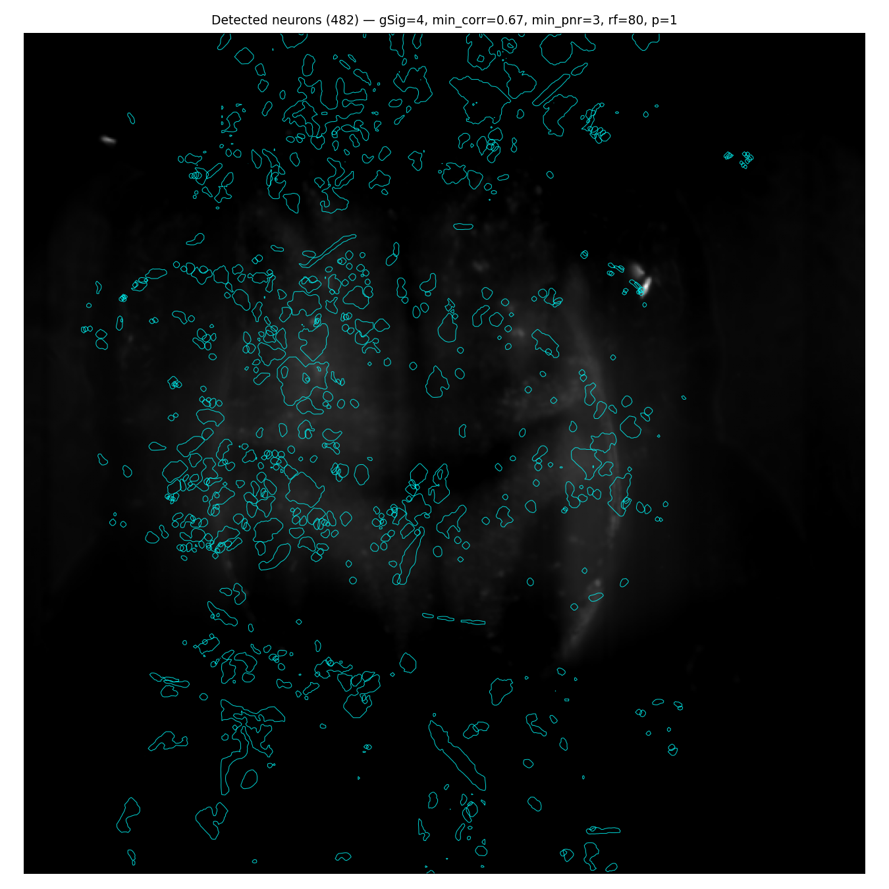
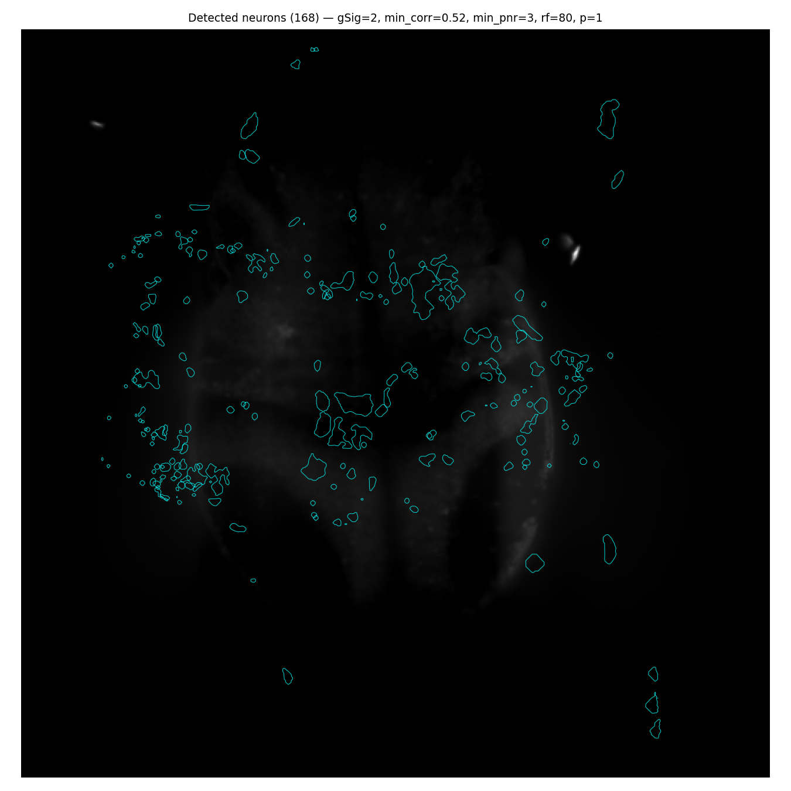
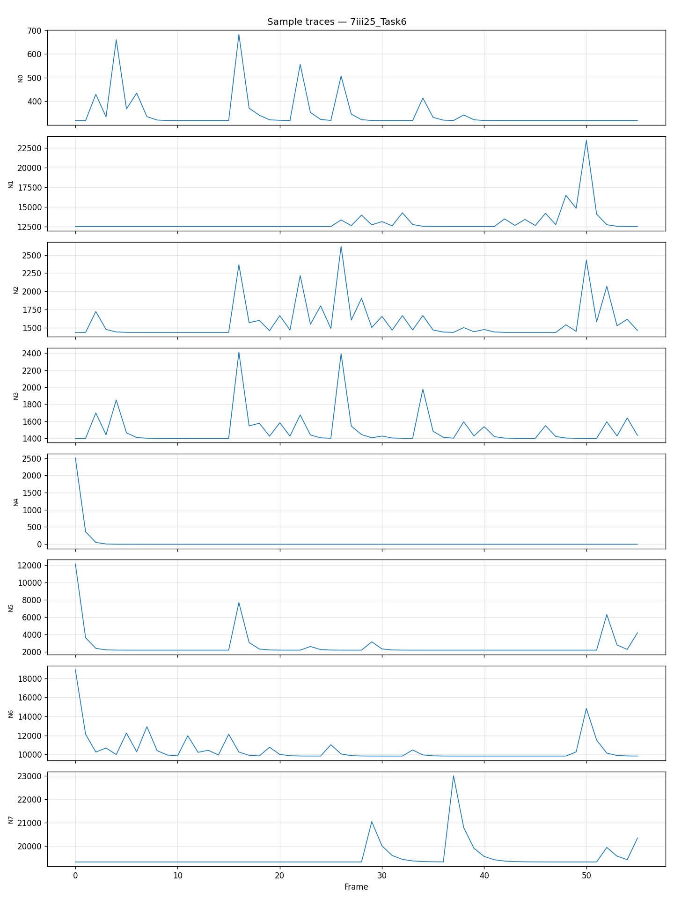
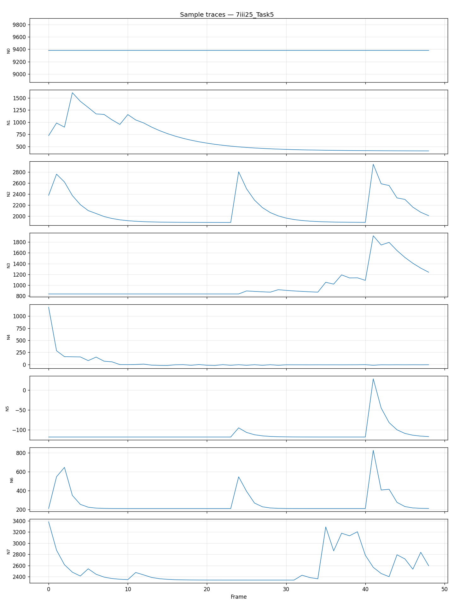
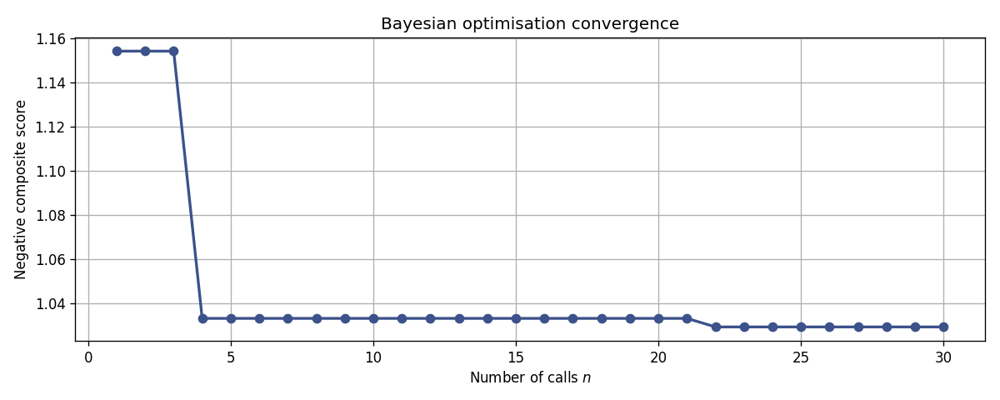

<!--
Slide deck for biology audience.
Designed to live at the root of the Fish_Brain_Dynamics repo so image paths resolve.
If kept in zebraFish/, replace image paths with absolute paths or copy to the repo.

Render options:
  - Copy section-by-section into Google Slides (one slide per "---" block)
  - Or render directly with Marp:
      npm install -g @marp-team/marp-cli
      marp slides_biology.md -o slides.pdf
  - Speaker notes live in HTML comments: <!-- note -->
-->

---
marp: true
theme: default
paginate: true
---

# Zebrafish Calcium Imaging
## Neuron Extraction Pipeline — 7iii25 Dataset

**Kiitan Ayandosu**
Tasks 4, 5, 6 — preliminary results

<!--
Speaker notes:
- This is the first pass of the automated pipeline
- Same fish, three different behavioral tasks
- Today: show what we can extract and what it looks like
-->

---

## The Problem

- **What we have:** light-sheet microscopy of larval zebrafish brain
- **What we see:** fluorescence that brightens when neurons fire (GCaMP signal)
- **What we want:**
  1. Find each neuron's **location** in the brain
  2. Extract its **activity trace** over time
- **Why it's hard:**
  - Hundreds of overlapping cells
  - Low signal-to-noise ratio
  - Imaging artifacts (vertical stripes from the light sheet)

<!--
Keep this at the "bio folks" level. Emphasize the scientific goal, not the math.
-->

---

## The Data



- 3 tasks from the same fish (Task 4, 5, 6)
- Each task: **42–56 timepoints**, **7 Z-planes** per timepoint
- Each plane: **2048 × 2048 pixels**
- File format: `.lux.h5` (one file per timepoint)

---

## The Pipeline

```
.lux.h5 files
     ↓
 pick middle Z-plane  ─→  stack across time  ─→  (T, 2048, 2048) movie
     ↓
 stripe removal (column-median subtraction)
     ↓
 CNMF — Constrained Non-negative Matrix Factorization
     ↓
 Bayesian hyperparameter tuning (30 trials)
     ↓
 neuron contours (where)  +  calcium traces (when)
```

<!--
CNMF is the standard algorithm for this — they'll recognize it.
Bayesian tuning = automatically searches for the best parameter combo instead of manual grid search.
-->

---

## Preprocessing — Stripe Removal


- **Left:** cleaned brain frame — bilateral structure visible
- **Right:** vertical stripe artifact we subtracted (hardware-level, same across all tasks)

<!--
Light-sheet microscopy has a characteristic column-intensity artifact.
We subtract the per-column temporal median — a clean, principled fix.
-->

---

## Neuron Detection — Task 4



**202 neurons detected.** Each cyan outline = one neuron's spatial footprint overlaid on the mean brain image.

<!--
Money slide #1. Point out:
- Contours land on the brain, not in empty background
- Concentrated in central / tectal regions — biologically expected
- The irregular shapes reflect CNMF finding cell-body-like footprints
-->

---

## Neuron Detection — Task 5 vs Task 6

<div style="display: flex; gap: 20px;">
  <div style="flex: 1;">
    <h3>Task 5 — 482 neurons</h3>
    
  </div>
  <div style="flex: 1;">
    <h3>Task 6 — 168 neurons</h3>
    
  </div>
</div>

**Same fish, same imaging setup — different tasks give different counts.**

<!--
Task 5 has more detections but some are in peripheral dark areas (likely over-detection).
Task 6 has fewer but cleaner, well-localized footprints.
This variability is real and worth investigating.
-->

---

## Calcium Traces — Task 6 (best quality)



- **Each row = one neuron's activity over 56 frames**
- Sharp rise + slow decay = classic GCaMP calcium transient
- 6 of 8 example cells show clear, repeated firing events

<!--
Money slide #2. This is what the bio folks want to see.
Point to one clean trace and say "this is a neuron firing".
Task 6 has the best traces — lead with this, not Task 4.
-->

---

## Calcium Traces — Task 5



Mixed quality across sampled neurons — some show clear transients, some are flat.

<!--
Honest slide: not every detection is a real neuron.
Flat traces = background components that passed the threshold.
This is why we need stricter filtering or more frames.
-->

---

## Parameter Tuning — Bayesian Optimization



- Tested **30 parameter combinations** automatically
- Algorithm found the good regime after **~4 trials**, then refined
- All 3 tasks converged to similar parameters → the pipeline is reproducible

<!--
Don't spend much time here — bio folks care more about results than optimizer details.
Key takeaway: the tuning is automated and consistent across tasks.
-->

---

## Summary — Three Tasks

| | **Task 4** | **Task 5** | **Task 6** |
|---|---|---|---|
| Timepoints | 42 | 49 | 56 |
| Neurons detected | 202 | 482 | 168 |
| Best `gSig` | 2 | 4 | 2 |
| Best `min_pnr` | 3 | 3 | 3 |
| **Trace quality** | Mixed | Mixed | **Best** |

**Task 6 gave the cleanest, most biologically plausible neural activity.**

<!--
Lead the verdict with Task 6 — it's the scientifically strongest example.
-->

---

## What's Working

- **Pipeline runs end-to-end** on the lab machine (Dell, 96 cores)
- **Preprocessing cleanly removes** the light-sheet stripe artifact
- **Neurons land on the brain** in expected regions (central, tectal)
- **Task 6 traces** show genuine, repeated calcium transients
- **Parameter search is reproducible** across tasks

---

## Current Limitations

- **Short recordings** (42–56 frames) limit temporal statistics
- **Only middle Z-plane analyzed** — may miss neurons at other depths
- **Downsampled to 512×512** for speed — losing some spatial detail
- **Some detections are noise** at permissive thresholds (esp. Task 5)

<!--
Honesty builds credibility. These are all actively being addressed.
-->

---

## Next Steps

1. **Full 2048×2048 resolution** (no downsampling — avoid any info loss)
2. **All 7 Z-planes**, not just the middle one
3. **Cross-validation framework** (from professor):
   - Tune & test within same file & plane (time split)
   - Tune within file, test across planes
   - Tune on one file, test on another (same plane)
   - Tune on one file, test across all files & planes
4. **Refine composite score** (currently negative — rescale to be interpretable)

<!--
This roadmap addresses every concern the professor raised.
Positions the work as rigorous, not just exploratory.
-->

---

## Questions?

**Repo:** [github.com/Mikito-Coder/Fish_Brain_Dynamics](https://github.com/Mikito-Coder/Fish_Brain_Dynamics)

All outputs (plots, traces, parameter logs) under `results/7iii25_Task{4,5,6}/`

<!--
End with a pointer so anyone can dig into the data themselves.
-->
